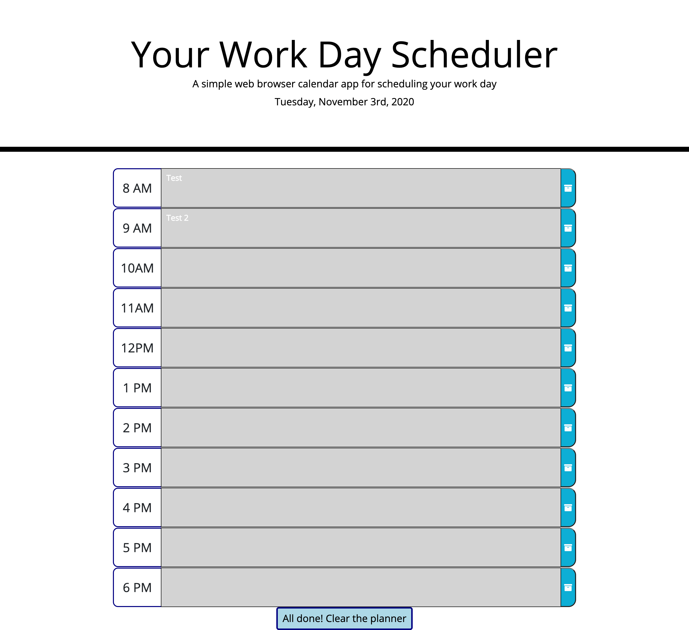

# Daily_Planner

## Installation
Clone repository to access the .html and .css files.

Repository is held at https://github.com/hector-gm/Daily_Planner

## Sample
Live sample of the project is hosted at https://hector-gm.github.io/Daily_Planner/ 

Off-hours sample: 

## Usage
For primary use by individuals working a more or less traditional work day that may need assistance managing a planner to keep reminders of meetings or tasks happening within the hours of 8am and 6pm. Code can be easily modified to include half hour slots if needed. 

Saved tasks / meeting reminders are committed to local storage for easy reference on future browser sessions.

## Credits

## Licence
This project holds an MIT Licence with *As Is* status as of latest update of the code.
